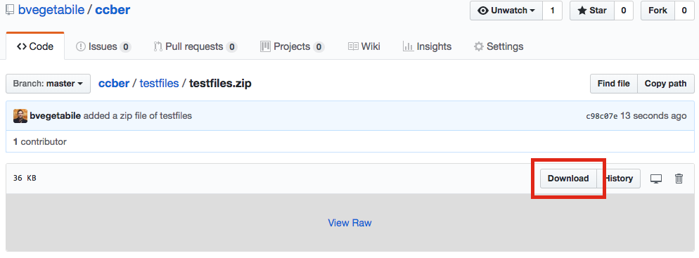
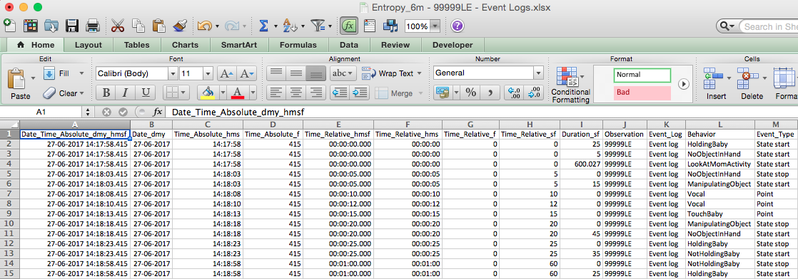

```{r setup, include=FALSE}
knitr::opts_chunk$set(echo = TRUE)
```

# Overview of Software

$\texttt{ccber}$ is an `R` package for the estimation of behavioral entropy rate, developed for the Conte Center @ UCI.  The package reads in an individual, or set of, excel files and processes the file to estimate the entropy rate from the supplied data.  This document describes usage and input formats that are expected with this software.

See reference: Davis, E.P., Stout, S.A., Molet, J., Vegetabile, B., Glynn, L.M., Sandman, C.A., Heins, K., Stern, H., Baram, T.Z. (in press). **Exposure to unpredictable maternal sensory signals influences cognitive development across-species**. _Proceedings of the National Academy of Sciences_.

An overview of behavioral entropy rate estimation in the context of human behavior is found in the supplemental in the reference above.  

The source files for `ccber` are found at [github.com/bvegetabile/ccber](https://www.github.com/bvegetabile/ccber)

## Installation of `ccber`

The package `devtools` is required to install this `R` package from this Github repository.  Install this package first if it is not already installed.

From within an `R` console, enter the following:

```{r, echo=TRUE, eval=FALSE}
install.packages('devtools', dependencies = TRUE)
```

Once that package has been installed, use the following to install `ccber`

```{r, echo=TRUE, eval=FALSE}
devtools::install_github('bvegetabile/ccber')
```

Load the package to begin analysis!

```{r, echo=TRUE, eval=F}
library('ccber')
```

## Quick Start

Download files from [github.com/bvegetabile/ccber/tree/master/testfiles/testfiles.zip](https://github.com/bvegetabile/ccber/blob/master/testfiles/testfiles.zip).  



Navigate to the directory where the files are located using, following code ( _Note in the below, the path should be changed to the location of where the files have been uncompressed_ )
```{r, eval=F, echo=T}
setwd('~/git/ccber/testfiles/')
```

Then run the following,

```{r, eval=F, echo=T}
test_output <- ccber::ber_analyze_dir('.')
```

By setting the working directory in the first step, any output files will be put in directory specified.  

If successful, you fill will see the following:

```{r, echo=TRUE, eval=F}
> ccber::ber_analyze_dir('.')
Completed without issue    :  Entropy_6m - 88888HE - Event Logs.xlsx
Completed without issue    :  Entropy_6m - 99999LE - Event Logs.xlsx
Script total run time:  0.013 minutes
-------------------- Check the log for files below --------------------
```

The object `test_output` will look as follows:

```
> test_output
  SubjectID CanEstimateEntropy EntropyRate
1   88888HE               TRUE   1.2755499
2   99999LE               TRUE   0.6442886
  TotalNumberOfTransitions CombinedVideoDuration PercentMissing
1                      119               600.027              0
2                       69               600.027              0
  AuditoryCounts AuditoryTotalTime AuditoryAverageTime
1             23            25.001               1.087
2             15            15.000               1.000
  VisualCounts VisualTotalTime VisualAverageTime TactileCounts
1           16        309.9636          19.37273            21
2           11        185.0270          16.82064            10
  TactileTotalTime TactileAverageTime
1         362.9628           17.28394
2         285.0273           28.50273
```


## Function Overviews

### Function : `ber_analyze_file`

The following function from `ccber` is one of the primary functions for the estimation of entropy rate:

```{r, echo=TRUE, eval=FALSE}
ber_analyze_file(f_loc,
                 plot_all=F,
                 plots_to_file=F,
                 tactile_padding = 1.0,
                 auditory_padding = 1.0,
                 behavior_types=list(
                   "mom_auditory_types" = c('Vocal'),
                   "mom_tactile_types" = c('TouchBaby',
                                           'HoldingBaby'),
                   "mom_visual_types" = c('ManipulatingObject'),
                   "baby_visual_types" = c('LookAtMomActivity'),
                   "missing_types" = c('CantTellHolding',
                                       'ActivityNotVisible',
                                       'CantTellLooking')),
                 missing_threshold = 0.1)
```

Below is a more detailed description of each input:

| Input               | Input Type    | Description               
|:-------------------:|:-------------:|:--------------------------------------------------
| `f_loc`             | String        | String indicating the location of the file of interest
| `plot_all`          | Logical       | Indicator of whether to provide visualization to the user. Values : `True` or `False`
| `plots_to_file`     | Logical       | Indicator of whether or not to save visuals. Currently not implemented.  
| `tactile_padding`   | Numeric       | Value (in seconds) to right pad each tactile point event
| `auditory_padding`  | Numeric       | Value (in seconds) to right pad each auditory point event
| `behavior_types`    | List          | List outlining the behavioral states expected.  Required : `mom_auditory_types`, `mom_tactile_types`, `mom_visual_types`, `baby_visual_types`, `missing_types`.  These categories define the sensory domains as in the original paper.  See the example code above for the default values expected in each category.  
| `missing_threshold` | Numeric       | Value (a proportion) that indicators how much missingness is acceptable.  This threshold is defined to be the percentage of the behavioral sequence that is represented by missing types defined in `missing_types`.  

#### Example Usage

```{r, echo=TRUE, eval=FALSE}
ber_analyze_file('./testfiles/Entropy_6m - 88888HE - Event Logs.xlsx')
```

#### Output

`ber_analyze_file` returns an `R` `list` whose first element is a `data.frame` named `estimates` and a second element that is a list called `file_checks`.  The element `estimates` is the primary object of interest and has the following column headings

| Column Header              | Description               
|:-------------------------- |:--------------------------------------------------
| `SubjectID`                | Subject ID found during analysis of file
| `CanEstimateEntropy`       | Indicator of success or failure in estimating entropy rate
| `EntropyRate`              | Estimate of entropy rate between 0 and $log_2(K)$ where $K$ is the total number of states
| `TotalNumberOfTransitions` | The total number of events considered in the final event sequence
| `CombinedVideoDuration`    | Total duration of the video (`endtime` + `final duration`)
| `PercentMissing`           | Proportion of time represented by `missing_types` category
| `AuditoryCounts`           | Total number of events in auditory category
| `AuditoryTotalTime`        | Total time representing events in auditory category
| `AuditoryAverageTime`      | Average duration of events in auditory category
| `VisualCounts`             | Total number of events in visual category
| `VisualTotalTime`          | Total time representing events in visual category
| `VisualAverageTime`        | Average duration of events in visual category
| `TactileCounts`            | Total number of events in tactile category
| `TactileTotalTime`         | Total time representing events in tactile category
| `TactileTotalTime`         | Average duration of events in tactile category

During the course of running, the script performs a series of quality assurance tests of the file that has been input.  Specifically it performs the following tests:

| Test Name     | Description               
|:------------- |:--------------------------------------------------
| `header_pass` | Checks for the following column headers : `c('Observation', 'Behavior', 'Time_Relative_sf', 'Duration_sf', 'Event_Type')`
| `subjid_pass` | Checks for an entry in the first cell of the column `Observation`.  Does not check format of subject IDs
| `misdat_pass` | Checks for empty cells in the columns list above using `sum(is.na(behavior_data$Behavior)) > 0`
| `blabel_pass` | Finds the unique entries in the column `Behavior`, then compares that with the labels in `behavior_types`.  Reports unused labels, i.e., labels found in `Behavior` that were not including in `behavior_types`. 
| `elabel_pass` | Finds the unique entries in the column `Event_Type`, then compares with the following list : `c('State start', 'State point', 'Point', 'State stop', 'State Stop')`.  These are currently supported events types.
| `misnes_pass` | Checks the proportion of time representing missing data based off of the inputs to `missing_types` within `behavior_types`.  

#### Example output from script:

When running `ber_analyze_file` by itself, the following is an example of what is printed to the console at runtime to help diagnose issues with files:

```
-----------------------------------------------------------------------
Filename:         Entropy_6m - 88888HE - Event Logs.xlsx 
Time of Analysis: 2018-06-04 10:33:12 
-----------------------------------------------------------------------
*************************** Performing File Check *********************
- Checking for required Columns:
	Observation      : First cell used to set "SubjectID"
	Behavior         : Set of used behavior labels
	Time_Relative_sf : Sets the start point for each action
	Duration_sf      : Time_Relative_sf + Duration_sf sets end points
	Event_Type       : Defines point events and states
--- PASSED : Found all Required Column Headers
- Checking "Observation" Column For Subject ID
--- PASSED: Using Subject ID from Column J, Cell 1: 88888HE 
- Checking for Missing Data in Columns
--- "Behavior"         : PASSED
--- "Time_Relative_sf" : PASSED
--- "Duration_sf"      : PASSED
--- "Event_Type"       : PASSED
- Checking "Behavior" Column For Unused Labels:
--- WARNING : Unused Labels in "Behavior" Column, See Below:
	Expected Label  : "NotHoldingBaby", not used in analysis
	Expected Label  : "NoObjectInHand", not used in analysis
--- NOTE: Investigate this if these do not look familar
- Checking "Event_Type" Column For Labels:
--- PASSED : No Unused Labels in "Event_Type" Column
- Checking Missingness based on "missing_types"
--- Percent Missingness: 0 
--- PASSED : Percent missing less than threshold
-----------------------------------------------------------------------
************************ File Completed Successfully ******************
-----------------------------------------------------------------------
```

### Function : `ber_analyze_dir`

The following function is another primary functions for the estimation of entropy rate.  Given a directory, the function makes multiple calls to `ber_analyze_file` to analyze the excel files within that directory.  Note that there is no plotting capability currently included when operating on directories. 

```{r, echo=TRUE, eval=FALSE}
ber_analyze_dir(dir_loc,
                tactile_padding = 1.0,
                auditory_padding = 1.0,
                behavior_types=list(
                  "mom_auditory_types" = c('Vocal'),
                  "mom_tactile_types" = c('TouchBaby',
                                          'HoldingBaby'),
                  "mom_visual_types" = c('ManipulatingObject'),
                  "baby_visual_types" = c('LookAtMomActivity'),
                  "missing_types" = c('CantTellHolding',
                                      'ActivityNotVisible',
                                      'CantTellLooking')),
                missing_threshold = 0.1,
                log_file = paste(Sys.Date(), '-ber-logfile.txt', sep=''))
```


| Input               | Input Type    | Description               
|:-------------------:|:-------------:|:--------------------------------------------------
| `dir_loc`           | String        | String indicating the location of the directory of interest
| `tactile_padding`   | Numeric       | Value (in seconds) to right pad each tactile point event
| `auditory_padding`  | Numeric       | Value (in seconds) to right pad each auditory point event
| `behavior_types`    | List          | List outlining the behavioral states expected.  Required : `mom_auditory_types`, `mom_tactile_types`, `mom_visual_types`, `baby_visual_types`, `missing_types`.  These categories define the sensory domains as in the original paper.  See the example code above for the default values expected in each category.  
| `missing_threshold` | Numeric       | Value (a proportion) that indicators how much missingness is acceptable.  This threshold is defined to be the percentage of the behavioral sequence that is represented by missing types defined in `missing_types`
| `log_file`          | String        | String indicating the location for where to save the diagnostic information from each run of `ber_analyze_file`


#### Example Usage

From the directory where the files of interest are located type the following:

```{r, echo=TRUE, eval=FALSE}
ber_analyze_dir('.')
```
#### Output

`ber_analyze_dir` returns a `R` `data.frame` with column headings as in `ber_analyze_file`.  Each row of the `data.frame` represents the results from calling `ber_analyze_file` on a file.

## Input file formats

This section describes the expected input file format required for the software.  It is also identifies important columns utilized in the estimation of entropy rate.  

#### File Format Type

At the moment, the required format is an Excel `.xlsx` file.  In the future this may be modifed to include `.csv` files, by altering specific lines of code in `ber.R`.  Specifically, line 37 within `ber_analyze_dir` should be altered to accept different string patterns:
```{r, eval=F, echo=T}
all_files = list.files(dir_loc, pattern="*.xlsx")
```
and line 116 within `ber_analyze_file` should be changed read `.csv` files:
```{r, eval=F, echo=T}
behavior_data <- data.frame(readxl::read_xlsx(f_loc))
```

#### File Organization

Below is a visualization of a current file that successfully is processed by `ccber` located within the `testfiles` subdirectory of the source files:



The expected column headings are:

| Column Heading                | Used? | Description               
|:-----------------------------:|:-----:|:--------------------------------------------------
| `Date_Time_Absolute_dmy_hmsf` | No    | Absolute Time - Day-Month-Year Hour:Min:Sec.Millisec (Military Time)
| `Date_dmy`                    | No    | Absolute Time - Day-Month-Year 
| `Time_Absolute_hms`           | No    | Absolute Time - Hour:Min:Sec
| `Time_Absolute_f`             | No    | ??? Appears to be millisecond part ???
| `Time_Relative_hmsf`          | No    | Relative Time - Hour:Min:Sec.Millisec
| `Time_Relative_hms`           | No    | Relative Time - Hour:Min:Sec.Millisec
| `Time_Relative_f`             |	No    | ??? Appears to be millisecond part ???
| `Time_Relative_sf`            | Yes   | Relative Time - Seconds.  Used as starting point for each instance in the video
| `Duration_sf`                 | Yes   | Relative Time - Seconds.  Duration of the the instance.  The time of an event is `Time_Relative_sf` + `Duration_sf`
| `Observation`                 | Yes   | Typically Subject ID.  Cell `J1` is used as the Subject ID that is reported from `ber_analyze_dir` and `ber_analyze_file` 
| `Event_Log`                   | No    | Unknown
| `Behavior`                    | Yes   | Used to find and match against `behavior_types` specified in `ber_analyze_dir` and `ber_analyze_file` 
| `Event_Type`                  | Yes   | `State start` indicates cells which will be used as _events_. `Point` instances that are included will be right padded to become events.  `State stop` rows are ignored.    

The order of the rows should **not** matter, but it is best to be safe and keep the organization that is above for ease of processing.  

### Input File Tests

As stated above the following tests are run using `ber_analyze_file` and are shown again below:

| Test Name     | Description               
|:------------- |:--------------------------------------------------
| `header_pass` | Checks for the following column headers : `c('Observation', 'Behavior', 'Time_Relative_sf', 'Duration_sf', 'Event_Type')`
| `subjid_pass` | Checks for an entry in the first cell of the column `Observation`.  Does not check format of subject IDs
| `misdat_pass` | Checks for empty cells in the columns list above using `sum(is.na(behavior_data$Behavior)) > 0`
| `blabel_pass` | Finds the unique entries in the column `Behavior`, then compares that with the labels in `behavior_types`.  Reports unused labels, i.e., labels found in `Behavior` that were not including in `behavior_types`. 
| `elabel_pass` | Finds the unique entries in the column `Event_Type`, then compares with the following list : `c('State start', 'State point', 'Point', 'State stop', 'State Stop')`.  These are currently supported events types.
| `misnes_pass` | Checks the proportion of time representing missing data based off of the inputs to `missing_types` within `behavior_types`.  

Be sure to check the log files and output using `ber_analyze_dir` to ensure that the files are processed correctly.  
